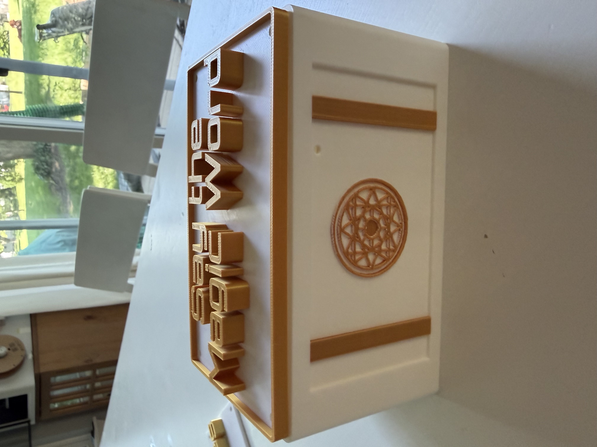
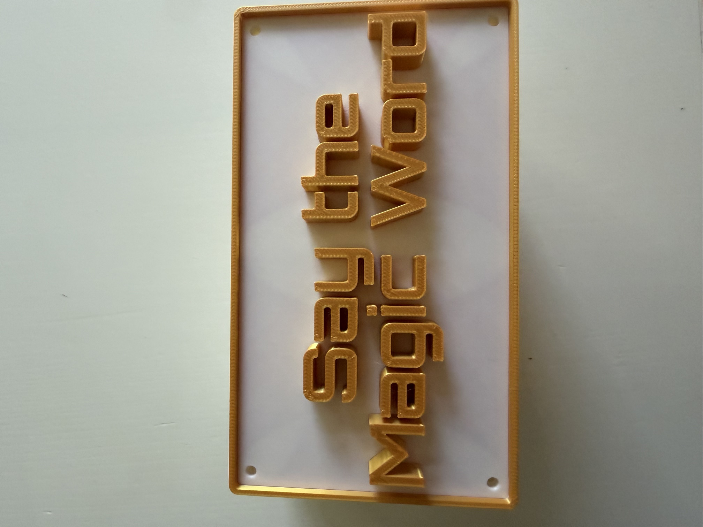
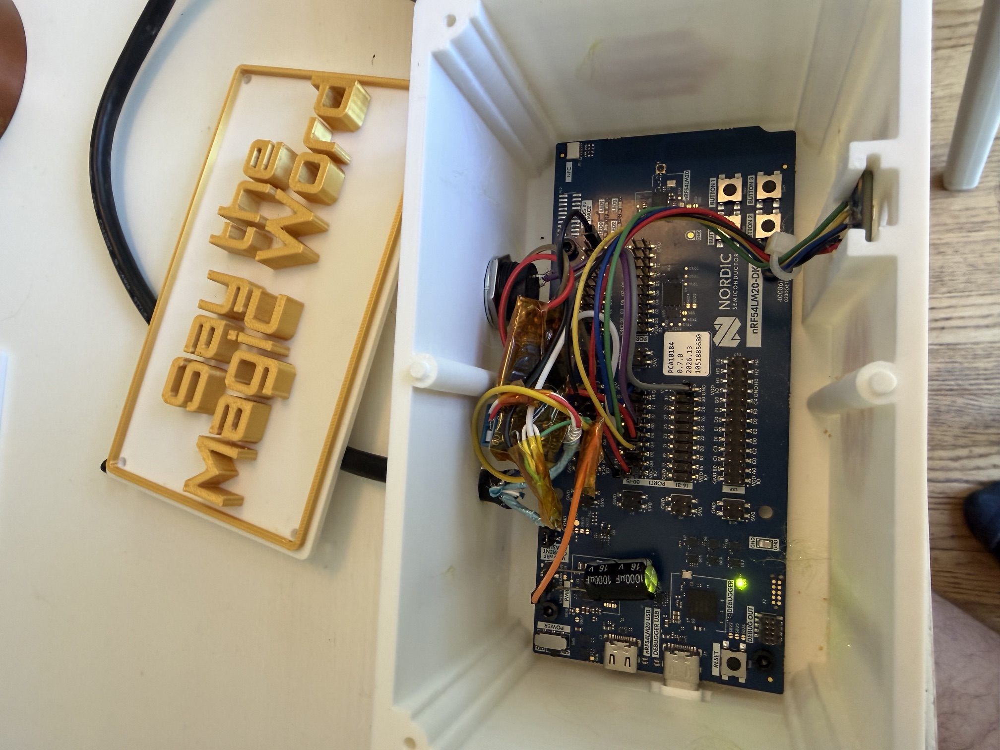

# Smart Toilet — voice-triggered flush

> ✨ **Say "Abracadabra," and the toilet flushes.** No buttons, no app, no cloud —
> just your voice and a little magic.

## The story

This started when the electronic capacitive-sensing toilets I have stopped working
correctly, and I felt the need to fix it. I rigged them up to flush from a button
press, monitored by an Arduino, and added a Hall effect sensor to read the motor
shaft position so it always stops at home.

I'd wanted to make it voice-activated for *years*. I tried with an nRF5340 and Edge
Impulse and could never get it working, so I put it away and lived with the button.

Then Nordic released the new **Edge AI Lab** and **Edge AI add-on**, and everything
changed. I built this ML model in about an hour. You can too — it's genuinely that
easy. And with the **Nordic MCP**, you can do nearly all of it without writing much
code. Give it a try!

I designed the enclosure using **Claude** and **Codex** together, iterating a few
times until everything was the way I liked it. It's the 3D-printed "magic chest" the
hardware lives in below.

Everything here is open source. The one exception is Nordic's AI, which is licensed
to run only on Nordic microcontrollers.

---

**Smart Toilet** is a voice-activated flush actuator for the **nRF54LM20 DK**, built
on the nRF Edge AI add-on. Saying the magic word **"Abracadabra"** drives a flush
motor through one rotation and stops it at the home position using a Hall sensor.

Detection runs fully on-device on the Axon AI accelerator — there is no network
connection and no audio leaves the board. The application runs in **wake-word-only
mode**: it listens continuously for the single phrase "Abracadabra" and has no
keyword-spotting stage.

- Board target: `nrf54lm20dk/nrf54lm20b/cpuapp`
- Application mode: `APP_MODE_WW_ONLY`
- Wake word: "Abracadabra" (`APP_WW_MODEL_ABRACADABRA`)



The hardware lives in a 3D-printed "magic chest" enclosure (sources in
[`enclosure/`](enclosure/)) whose lid reads *Say the Magic Word*.

| Lid | Internals |
|-----|-----------|
|  |  |

## How it works

1. The PDM microphone (`pdm20`) captures single-channel 16 kHz audio (`src/dmic.c`).
2. Each audio block passes through the front-end cleanup chain (`src/audio_proc.c`):
   a fixed PDM hardware gain, a high-pass filter, then software AGC — see
   [Audio front-end](#audio-front-end) below.
3. The wake-word model (an nRF Edge AI Lab model, selected by the
   `APP_WW_MODEL` Kconfig choice) runs on the Axon accelerator (`src/ww/`). A
   detection requires the per-frame probability to exceed
   `CONFIG_WW_PROBABILITY_THRESHOLD` (0.60) for 7 of the last 20 ~30 ms frames,
   plus a ~1 s refractory period so one utterance fires exactly once.
4. On detection, `actuator_flush()` runs the motor and stops it when the Hall
   sensor sees the shaft magnet return home (`src/actuator.c`). LED0 blinks for
   one second and `Wakeword detected` is printed on the control UART (VCOM0).

**Why "Abracadabra":** wake words with more syllables and plosive consonants
survive far-field room reverb far better. The original 2-syllable "Shazaam"
managed only ~50% detection at the deployment distance; "Abracadabra"
(5 syllables, plosive-rich with alternating open vowels) reaches ~95–100%.

## Audio front-end

Each 10 ms audio block is cleaned up before it reaches the model. The chain is,
in order:

1. **PDM hardware gain** — `CONFIG_APP_PDM_GAIN_DB` (default **+20 dB**) applied
   in the PDM peripheral via `nrf_pdm_gain_set()` in `src/dmic.c` (the Zephyr
   DMIC API does not expose gain). Sized for far-field use; without it, speech at
   the deployment distance peaks around −25 dBFS.
2. **High-pass filter** — `CONFIG_APP_AUDIO_HPF`, a 2nd-order Butterworth
   high-pass at **120 Hz**. There is little speech energy below the cutoff, so it
   strips low-frequency rumble and handling noise at negligible cost to the model
   input.
3. **Automatic gain control (AGC)** — `CONFIG_APP_AGC` tracks the speech peak
   envelope and applies a smoothed software gain (±12 dB) that pulls speech
   toward `CONFIG_APP_AGC_TARGET_DBFS` (**−20 dBFS**), so detection is far less
   sensitive to how far the speaker is from the mic. It uses a fast ~50 ms
   release downward (to step away from saturation quickly) and a slow ~300 ms
   attack upward (so converging gain does not warp a word mid-utterance), and is
   gated below −38 dBFS so it rides utterance peaks instead of pumping the room
   noise floor.

The AGC acts *after* the PDM hardware gain, so it cannot undo saturation that
already happened in the peripheral — keep `APP_PDM_GAIN_DB` low enough that close
or loud speech does not clip (the model returns ~0 probability on saturated
audio). See [Tuning the mic and wake word](#tuning-the-mic-and-wake-word).

## Hardware / pinout

| Signal      | Pin   | Notes |
|-------------|-------|-------|
| Motor drive | P1.06 | Active-high → logic-level MOSFET gate |
| Hall sensor | P1.07 | Active-low, internal pull-up; **power the sensor from 5 V** (DK headers P6–P10/P18 pin 1) |
| PDM mic CLK | P1.04 | Adafruit 3492 (ST MP34DT01-M) |
| PDM mic DAT | P1.05 | mic SEL→GND (left channel), VDD→1.8 V IO |

> **Do not use P2.00–P2.05** as header GPIO on this DK: the board controller mux
> routes them to the onboard QSPI flash, so the header pins are dead by default.
> P1/P3 pins are plain GPIO and work directly.

### Wiring

```
 nRF54LM20 DK                         External circuit
 ------------                         ----------------
 P1.06  ───────────────► gate         logic-level MOSFET
 GND    ───────────────► source       drain ─► motor(-) , motor(+) ─► motor supply +
                                       (flyback diode across the motor)

 5V0 (P6..P18 pin 1) ──► Hall VCC      Hall switch, magnet on the motor shaft
 GND ─────────────────► Hall GND
 P1.07 ◄──────────────── Hall OUT      idles ~3.6 V, pulls to 0 V when magnet present

 P1.04 ──► mic CLK   P1.05 ◄── mic DAT   Adafruit 3492 (SEL→GND, VDD→1.8 V IO)
```

Keep all grounds common (DK GND, motor-supply GND, Hall GND). The Hall idles at
~3.6 V, which is at the nRF GPIO input maximum — add a resistor divider if you
see flaky reads.

### Actuator tuning

In `src/actuator.c`:

- `HALL_BLANKING_MS` (250) ignores the Hall sensor right after start — the magnet
  rests on the sensor at home, so without blanking, start-up jitter would end the
  flush immediately.
- `HALL_OVERRUN_MS` (100) keeps the motor running briefly *after* the magnet is
  sensed, letting the shaft settle into its resting position. Tune this for a
  clean stop.
- `MOTOR_SAFETY_MS` (1000) forces the motor off if the magnet is never sensed
  (jam, misaligned magnet, faulty sensor) so it cannot burn out. One rotation is
  ≈ 700 ms.

## Tuning the mic and wake word

With `CONFIG_APP_AUDIO_STATS=y` (on by default in `prj.conf`), the log UART
(VCOM1) prints one line of each per second:

```
audio: peak -4.2 dBFS, rms -21.7 dBFS, clipped 0/16000
agc: gain +6.0 dB (env -18.4 dBFS)
ww: peak prob 0.62 (bar 0.80), peak votes 4/10
```

Say the wake word from the normal use position and read the lines for that second:

- **`clipped` > 0 or peak pinned at 0.0 dBFS** → the mic is distorting; lower
  `CONFIG_APP_PDM_GAIN_DB` (0.5 dB hardware steps, range −20..+20).
- **Speech peaks below about −20 dBFS** → too quiet for the model; raise
  `CONFIG_APP_PDM_GAIN_DB`.
- **`peak prob` never crosses the bar** even with healthy levels → lower
  `CONFIG_WW_PROBABILITY_THRESHOLD` (in 1/1000).
- **`peak prob` crosses but `peak votes` stays short of the target** → the hits
  are too spread out; lower `CONFIG_WW_COUNT_THRESHOLD` or raise
  `CONFIG_WW_HISTORY_SIZE`.

Aim for speech peaks around −6 to −3 dBFS with zero clipped samples, then tune the
thresholds. Set `CONFIG_APP_AUDIO_STATS=n` for the deployed build.

### Recording what the model hears

With `CONFIG_APP_AUDIO_SNAP=y`, send `S` on the control UART (VCOM0) to record
10 s of the processed mic audio and dump it back over VCOM0. Save it as a `.wav`
with `tools/uart_monitor.py snap --port <VCOM0>`.

## Build & flash

Built against the nRF Edge AI add-on, which bundles its own nrf/zephyr. The
simplest path is a plain NCS install (v3.3.1 works) with the add-on passed as an
extra Zephyr module. Fetch the add-on once (no `west update` needed):

```sh
west init -m https://github.com/nrfconnect/sdk-edge-ai --manifest-rev v2.1.0 <addon-dir>
```

Then build, pointing at the add-on module:

```sh
nrfutil sdk-manager toolchain launch --ncs-version v3.3.1 --chdir ~/ncs/v3.3.1 -- \
  west build -b nrf54lm20dk/nrf54lm20b/cpuapp -d build app -- \
    -DEXTRA_ZEPHYR_MODULES=<addon-dir>/edge-ai
```

Flash and reset (pass `--dev-id <JLINK_SN>` when more than one DK is attached):

```sh
nrfutil sdk-manager toolchain launch --ncs-version v3.3.1 -- \
  west flash -d build --dev-id <JLINK_SN>
```

> If `west flash` reports *"JLinkARM DLL not found"* but J-Link is installed in a
> non-standard location, program directly and point nrfutil at the DLL:
> `nrfutil device program --firmware build/app/zephyr/zephyr.hex --jlink-dll
> <path>/libjlinkarm.so --serial-number <SN>`, then `nrfutil device reset`.

### Output

- **VCOM0** — control messages: `Waiting for wakeword`, `Wakeword detected`.
- **VCOM1** — Zephyr log: actuator events plus the per-second audio/AGC/wake-word
  tuning stats when `CONFIG_APP_AUDIO_STATS=y`.

`tools/uart_monitor.py` is a small pyserial reader/monitor for both ports.

## Notes / lessons learned

- **P2.00–P2.05 are not usable as header GPIO** on this DK — the board controller
  routes them to the onboard QSPI flash. Disabling the flash in the devicetree
  does *not* reconnect the header pin; the SoC pin never reaches it. Use P1/P3
  GPIO instead.
- **Power the Hall sensor from 5 V.** On the 3 V rail it was below its minimum
  supply and never asserted. The output is **active-low** (0 V present, 3.6 V
  absent) — verify polarity with a meter rather than assuming.
- The flush stop uses a **blanking window**, not a leave-then-return state
  machine: at rest the magnet sits on the sensor, and jitter as it leaves would
  otherwise fire a false "rotation complete" within tens of milliseconds.
- **Pick a long, plosive-rich wake word.** Short fricative-led words lose exactly
  the high-frequency energy that room reverb destroys, so they collapse at
  far-field. See the `APP_WW_MODEL` choice for measured detection rates.
- With two DKs attached, always pass `--dev-id <JLINK_SN>` to `west flash`.

## License

This project is licensed under the Nordic 5-Clause License
(`LicenseRef-Nordic-5-Clause`) — see [LICENSE](LICENSE). It is intended for use
with Nordic Semiconductor integrated circuits.
